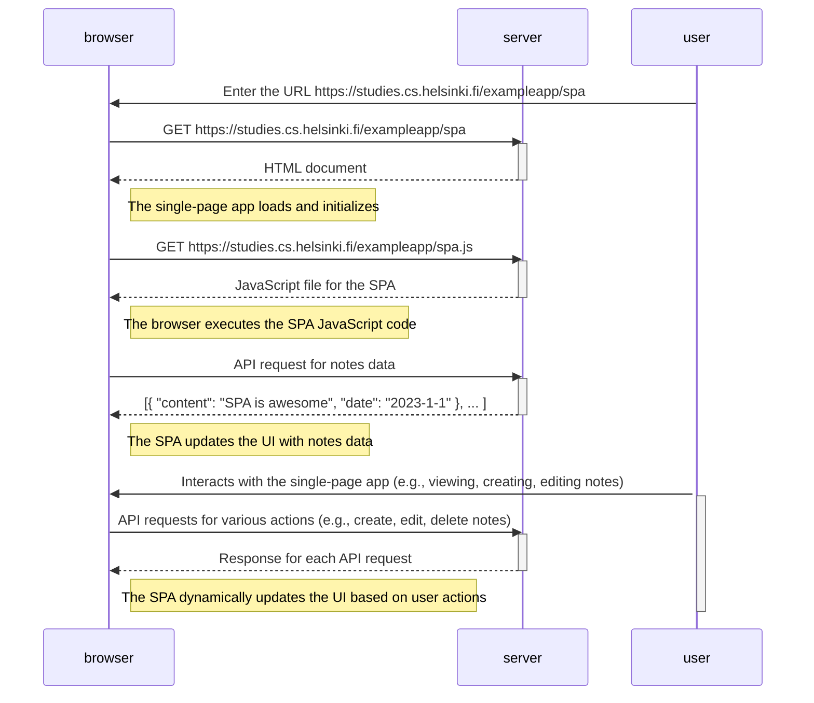

```mermaid

    sequenceDiagram
    participant browser
    participant server
    participant user

    user->>browser: Enter the URL https://studies.cs.helsinki.fi/exampleapp/spa
    activate user

    browser->>server: GET https://studies.cs.helsinki.fi/exampleapp/spa
    activate server
    server-->>browser: HTML document
    deactivate server

    Note right of browser: The single-page app loads and initializes

    browser->>server: GET https://studies.cs.helsinki.fi/exampleapp/spa.js
    activate server
    server-->>browser: JavaScript file for the SPA
    deactivate server

    Note right of browser: The browser executes the SPA JavaScript code

    browser->>server: API request for notes data
    activate server
    server-->>browser: [{ "content": "SPA is awesome", "date": "2023-1-1" }, ... ]
    deactivate server

    Note right of browser: The SPA updates the UI with notes data

    user->>browser: Interacts with the single-page app (e.g., viewing, creating, editing notes)
    activate user

    browser->>server: API requests for various actions (e.g., create, edit, delete notes)
    activate server

    server-->>browser: Response for each API request
    deactivate server

    Note right of browser: The SPA dynamically updates the UI based on user actions

    deactivate user

```