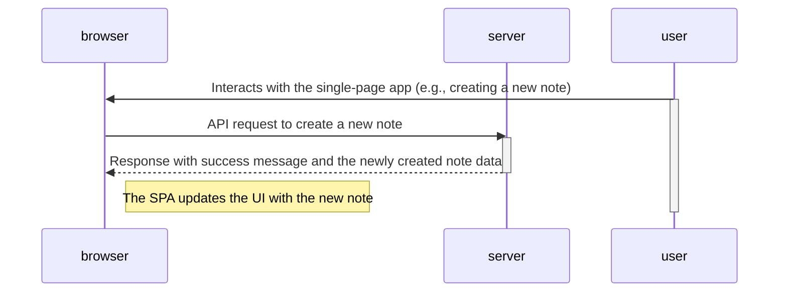

```mermaid
    sequenceDiagram
        participant browser
        participant server
        participant user

        user->>browser: Interacts with the single-page app (e.g., creating a new note)
        activate user

        browser->>server: API request to create a new note
        activate server

        server-->>browser: Response with success message and the newly created note data
        deactivate server

        Note right of browser: The SPA updates the UI with the new note

        deactivate user

```
